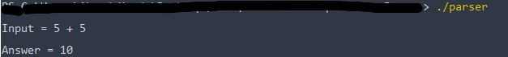

# Arithmetic Expression Scanner and Parser
This project is part of compiler design course.

### It support four arithmitic operations:
- Addition '+'
- Substration '-'
- Multiplication '*'
- Division '/'

### Tools used in the project
- #### FLEX: 
  FLEX (Fast LEXical analyzer generator) is a
  tool for generating scanners. In stead of writing a 
  scanner from scratch, you only need to identify the vocabulary of a certain language (e.g. Simple), write a specification of patterns using regular expressions (e.g. DIGIT [0-9]), and FLEX will construct a scanner for you. FLEX is generally used in the manner depicted here:
  

- #### Bison:
  Bison is a general-purpose parser generator that converts a grammar description (Bison Grammar Files) for an LALR(1) context-free grammar into a C program to parse that grammar. The Bison parser is a bottom-up parser. It tries, by shifts and reductions, to reduce the entire input down to a single grouping whose symbol is the grammar's start-symbol.
  

### how Flex and Bison work together
Yacc generates a parser in file y.tab.c and an include file y.tab.h. Lex includes this file (y.tab.h) and uses the definitions for token values found in this file for the returned tokens.

### How to run the Scanner and the parser
1. Install bison from <a href="https://gnuwin32.sourceforge.net/packages/bison.htm">link</a>
2. Install flex from <a href="https://gnuwin32.sourceforge.net/packages/flex.htm">link</a>
3. in the terminal type  `bison -d parser.y` to genrate the definiation and the grammer
4. then type `flex parser.l ` to run the lexical analzer
5. then type `gcc lex.yy.c parser.tab.c -o parser` to compile into c language
6. then type `./parser` to run the app

### ScreenShot for example

